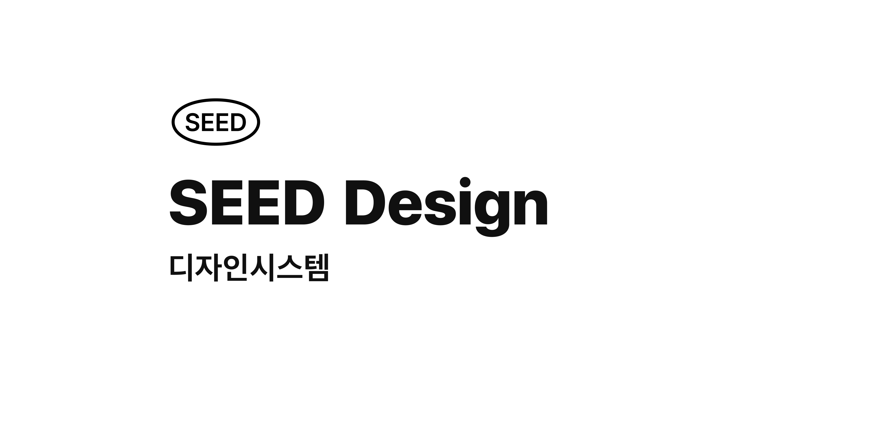

## External Install

Phase 1 public packages are validated for external consumers with:

- `@rideds/react`
- `@rideds/css`
- `@rideds/stackflow`
- `@rideds/cli`
- `@rideds/tailwind4-theme`

### React UI

```bash
bun add @rideds/react @rideds/css
```

```tsx
import "@rideds/css/all.css";
import { ActionButton } from "@rideds/react";

export function App() {
  return <ActionButton>RUI</ActionButton>;
}
```

### Stackflow Integration

```bash
bun add @rideds/stackflow @rideds/css @stackflow/core @stackflow/react
```

```ts
import "@rideds/css/all.css";
import { ruiPlugin } from "@rideds/stackflow";

const plugin = ruiPlugin({ theme: "android" });

void plugin;
```

### CLI

```bash
bunx @rideds/cli@latest --help
```

### Tailwind CSS 4

```bash
bun add @rideds/css @rideds/tailwind4-theme tailwindcss@^4
```

```css
@import "tailwindcss";
@import "@rideds/tailwind4-theme";
```

## Maintainers

Re-run the Phase 1 package gate locally with:

```bash
bun phase1:validate
```

**Definitions**

- [@rideds/rootage](./packages/rootage)
- [@rideds/qvism-preset](./packages/qvism-preset)

**Base Libraries**

- [@rideds/css](./packages/css)

**React Libraries**

- [@rideds/react-headless](./packages/react-headless)
- [@rideds/react](./packages/react)
- [@rideds/stackflow](./packages/stackflow)

**Integrations**

- [@rideds/figma](./packages/figma)
- [@rideds/mcp](./packages/mcp)

**Ecosystem**

- [@rideds/ecosystem/rootage](./ecosystem/rootage)
- [@rideds/ecosystem/qvism](./ecosystem/qvism)
- [@rideds/ecosystem/figma-extractor](./ecosystem/figma-extractor)

**Documentation**

- [@rideds/docs](./docs)
